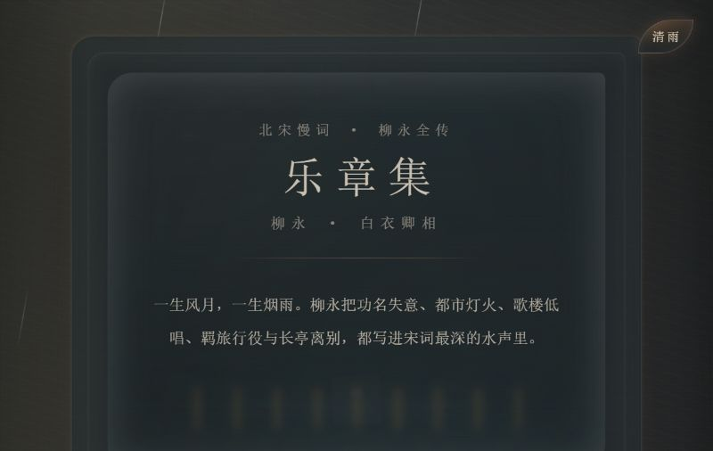
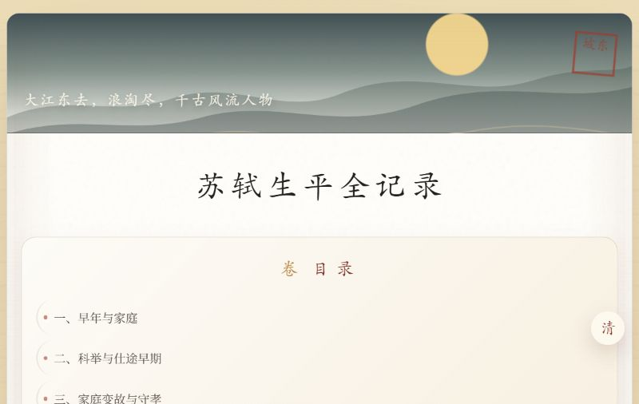
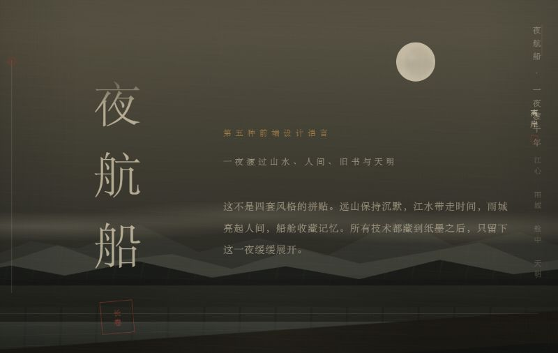

# InkNarratives / 墨叙

[](https://github.com/NoctilumeDev/InkNarratives/actions/workflows/repository-gates.yml)
[](https://noctilumedev.github.io/InkNarratives/)
[](./LICENSE)

中文文学主题的交互叙事前端实验集。五件作品各自保留独立的视觉语法，由一个克制的在线展厅负责索引，而不是被压成同一套模板。

> **Status: Prototype.** 页面可以运行，但不是组件库、生产模板或已经完成学术校勘的数字人文成果。

## 在线展厅

[进入墨叙在线展厅](https://noctilumedev.github.io/InkNarratives/)，从统一入口打开五件相互独立的作品。下列预览均来自作品在真实浏览器中的本地渲染，不是重新绘制的封面。

| 暗室 · 藏书 | 乐章集 |
| --- | --- |
| [](https://noctilumedev.github.io/InkNarratives/works/darkroom/) | [](https://noctilumedev.github.io/InkNarratives/works/liuyong/) |

| 苏轼生平全记录 | 空山见王维 | 夜航船 |
| --- | --- | --- |
| [](https://noctilumedev.github.io/InkNarratives/works/sushi/) | [](https://noctilumedev.github.io/InkNarratives/works/wangwei/) | [](https://noctilumedev.github.io/InkNarratives/works/night-voyage/) |

## 作品

| 作品 | 方向 | 稳定入口 | 当前阶段 |
| --- | --- | --- | --- |
| 暗室·藏书 | 暗室空间、灯光与滚动显影 | [`works/darkroom/`](./works/darkroom/) | 空间交互实验 |
| 乐章集 | 《乐章集》式柳永人物长页 | [`works/liuyong/`](./works/liuyong/) | 结构原型 |
| 苏轼生平全记录 | 生平、作品与章节化长文 | [`works/sushi/`](./works/sushi/) | 内容主参考 |
| 空山见王维 | 山水意象与人物编年 | [`works/wangwei/`](./works/wangwei/) | 编辑设计实验 |
| 夜航船 | 夜航、宣纸与连续场景 | [`works/night-voyage/`](./works/night-voyage/) | 滚动叙事实验 |

原有的 `暗室.html`、`柳永.html`、`苏轼.html`、`王维.html`、`长卷.html` 继续作为兼容入口，自动转向上述稳定英文路径，避免已有书签断链。

## 设计与工程边界

- 中文标题、正文和界面文案是作品的一部分，不需要改成英文。
- 五件作品仍是独立、零依赖的 HTML 页面；统一展厅不向作品注入共享运行时。
- 共享层只承担目录、公开 URL、预览图和发布，不抹平每件作品自己的视觉节奏。
- 人物生平与作品内容仍需补齐资料来源、编辑说明和事实核验；视觉完整度不等于内容可靠性。
- 展厅预览图来自作品在本地浏览器中的真实渲染，不是重新绘制的封面。

## 本地运行

在仓库根目录启动任意静态文件服务器：

```powershell
python -m http.server 8080
```

访问 `http://localhost:8080/` 查看展厅，也可直接打开任意 `works/*/index.html`。直接使用 `file://` 打开作品通常也能运行，但静态服务器更接近 GitHub Pages 的路径与资源行为。

## 正文修订时间

展签上的“正文修订”不是 HTML 文件或代码的最后修改时间，只记录文学、传记或叙事正文的实质修订。校验器默认核对作品第一个 `<main>`，并允许用 `data-content-revision-scope` 明确纳入位于其外的附加阅读正文；CSS、JavaScript、交互提示、响应式、部署和校验器调整不改变该日期。

仓库通过规范化后的正文 SHA-256 锁定作品元数据、展厅日期与修订清单，并在校验范围内的可读文本变化时拒绝静默通过。指纹只能发现差异，不能自动判断它属于文学正文修订还是界面与校验边界调整；日期是否推进仍需人工审查。静态门禁也不声称日期元素在最终样式下必然可见，这一事实由带日期的浏览器基线和人工复验承担。完整规则见 [正文修订时间契约](./docs/content-revision-policy.md)，机器可读基线见 [`docs/content-revisions.json`](./docs/content-revisions.json)。

## 质量门禁

运行：

```powershell
node scripts/verify-repository.mjs
```

校验覆盖的是仓库当前受控的静态 HTML 子集：它按注释、引号属性、真实标签和 `script` / `style` raw-text 边界读取源文件，不是通用 HTML5 解析器，也不替代浏览器计算后的 DOM。当前持续检查包括：

- 展厅、404、五件作品、预览图、稳定路径和旧入口是否完整；
- 真实标签上的 HTML 基础语义、标题层级、重复属性/ID、内联事件与本地 `src` / `href`；
- 常见资源加载属性、内联 CSS 和直接字面量加载 API 是否引入远程运行依赖；
- 正文修订日期与规范化文本指纹是否一致；
- GitHub Pages 发布所需文件是否齐备。

由运行时拼接出的任意 URL、浏览器错误恢复后的 DOM、CSS 最终可见性和所有畸形 HTML5 边角行为不在这条静态门禁的证明范围内；真实页面仍需按质量基线做浏览器复验。

2026-08-08 的桌面端 `1440x960` 与移动端 `390x844` 基线见 [质量基线](./docs/quality-baseline.md)，后续文章结构见 [编辑骨架](./docs/editorial-structure.md)。自动化结果不能替代键盘、屏幕阅读器、动效舒适度和内容事实的人工验收。

## 发布

`.github/workflows/pages.yml` 只发布展厅、404、兼容入口、作品与静态资源。每次 `main` 更新先执行仓库校验，通过后才上传不可变 Pages artifact 并部署；仓库文档、脚本和内部配置不会混入公开站点。

## 贡献与许可

修改前请阅读 [CONTRIBUTING.md](./CONTRIBUTING.md) 和 [社区行为准则](./CODE_OF_CONDUCT.md)。可复现缺陷与有界的编辑、设计或无障碍改进请从 [Issue 选择器](https://github.com/NoctilumeDev/InkNarratives/issues/new/choose) 进入；敏感安全问题仍按 [SECURITY.md](./SECURITY.md) 私下报告。

代码与仓库原创内容按 [Apache License 2.0](./LICENSE) 发布；引用的古典文学原文仍归属于其原作者及相应公共领域来源。
